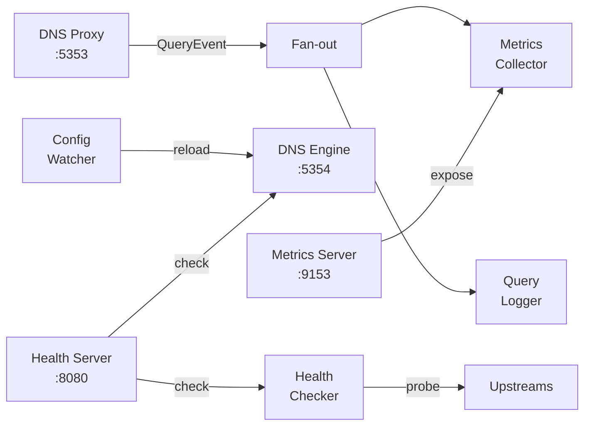

# Components

AstraDNS consists of four main components distributed across two planes.

## Operator

| Property | Value |
|----------|-------|
| Kind | Deployment |
| Replicas | 1 (with leader election for HA) |
| Image | `astradns/operator` |
| Ports | 8081 (health), 8443 (metrics), 9443 (webhook) |

The operator runs three controllers:

### DNSUpstreamPool Controller

Watches `DNSUpstreamPool` resources and renders engine configuration.

**Reconciliation flow:**

1. Validate the pool spec (addresses, ports)
2. Stamp `dns.astradns.com/initial-resource-version` annotation on first reconcile
3. Select the active pool (oldest by creation timestamp, then initial RV, then name)
4. Fetch the `default` DNSCacheProfile (if it exists)
5. Generate engine-agnostic `EngineConfig`
6. Validate by rendering through the active engine renderer
7. Marshal as JSON and write to ConfigMap
8. Set `Ready=True` condition on the active pool
9. Set `Ready=False, Reason=Superseded` on any non-active pools

### DNSCacheProfile Controller

Validates cache configuration and sets the `Active` condition. The profile named `default` is automatically used by the upstream pool controller.

### ExternalDNSPolicy Controller

Validates cross-references to upstream pools and cache profiles. Sets `Validated=True/False` conditions.

## Agent

| Property | Value |
|----------|-------|
| Kind | DaemonSet |
| Image | `astradns/agent` |
| Ports | 5353 (DNS), 8080 (health), 9153 (metrics) |

The agent runs seven components in parallel goroutines:



| Component | Responsibility |
|-----------|---------------|
| **DNS Proxy** | Intercepts queries on :5353 (UDP+TCP), forwards to engine on :5354, emits QueryEvent |
| **Metrics Collector** | Consumes QueryEvents, updates Prometheus counters/histograms |
| **Query Logger** | Consumes QueryEvents, writes structured JSON to stdout |
| **Health Checker** | Probes upstream resolvers periodically (UDP with TCP fallback) |
| **Config Watcher** | Watches ConfigMap directory via fsnotify, triggers engine reload |
| **Health Server** | HTTP server exposing `/healthz` (engine alive) and `/readyz` (engine + upstreams) |
| **Metrics Server** | HTTP server exposing `/metrics` in Prometheus format |

## CRDs

Three Custom Resource Definitions in the `dns.astradns.com` API group:

| CRD | Purpose | Scope |
|-----|---------|-------|
| `DNSUpstreamPool` | Define upstream resolvers, health checks, load balancing | Namespaced |
| `DNSCacheProfile` | Configure cache size, TTL bounds, prefetch | Namespaced |
| `ExternalDNSPolicy` | Map namespaces to pools and cache profiles | Namespaced |

See the [CRD Reference](../reference/crds/index.md) for full field documentation.

## DNS Engine

The engine is a subprocess managed by the agent. Three engines are supported:

| Engine | Config File | Reload Method | Default |
|--------|------------|---------------|---------|
| **Unbound** | `unbound.conf` | `unbound-control reload` | Yes |
| **CoreDNS** | `Corefile` | Auto-reload plugin | No |
| **PowerDNS Recursor** | `recursor.conf` | `rec_control reload-zones` | No |

All engines implement the same Go interface:

```go
type Engine interface {
    Configure(ctx context.Context, config EngineConfig) (string, error)
    Start(ctx context.Context) error
    Reload(ctx context.Context) error
    Stop(ctx context.Context) error
    HealthCheck(ctx context.Context) (bool, error)
    Name() EngineType
}
```

See [Engine Selection](engine-selection.md) for guidance on choosing an engine.
