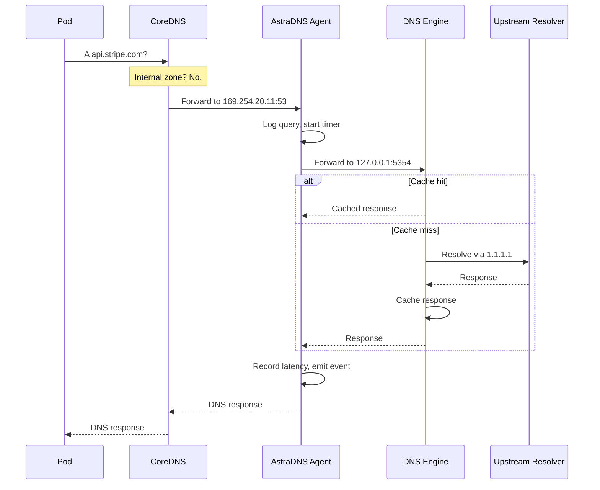

# Data Path

Understanding how DNS queries flow through AstraDNS is critical for debugging, capacity planning, and security analysis.

## Query Flow



## Network Modes

### hostPort (default)

The agent binds to port `5353` on the node's primary IP via Kubernetes `hostPort`.

```
Pod → CoreDNS → Node:5353 (agent) → 127.0.0.1:5354 (engine) → upstream
```

- Simple to set up
- No host network required
- CoreDNS must be configured to forward to `<nodeIP>:5353`

### linkLocal (recommended)

The agent binds to the link-local address `169.254.20.11:53` using `hostNetwork: true`.

```
Pod → CoreDNS → 169.254.20.11:53 (agent) → 127.0.0.1:5354 (engine) → upstream
```

- Standard port 53 (no special client configuration)
- Consistent address across all nodes
- CoreDNS forwards to a single address regardless of node IP
- Follows the established NodeLocal DNS Cache pattern

!!! tip "Production recommendation"
    Use linkLocal mode with CoreDNS integration enabled. This is the most reliable and widely-tested configuration.

## Cache Behavior

Each node maintains its own cache. There is no cross-node cache sharing.

| Property | Controlled By |
|----------|--------------|
| Maximum entries | `DNSCacheProfile.spec.maxEntries` |
| Minimum positive TTL | `DNSCacheProfile.spec.positiveTtl.minSeconds` |
| Maximum positive TTL | `DNSCacheProfile.spec.positiveTtl.maxSeconds` |
| Negative TTL | `DNSCacheProfile.spec.negativeTtl.seconds` |
| Prefetch | `DNSCacheProfile.spec.prefetch.enabled` |
| Prefetch threshold | `DNSCacheProfile.spec.prefetch.threshold` |

!!! info "Per-node cache isolation"
    Cache is isolated per node. A query cached on Node A is not available on Node B. This is a deliberate design choice for fault isolation — a poisoned cache on one node does not propagate to others.

## Failure Modes

| Failure | Behavior | Recovery |
|---------|----------|----------|
| Agent pod crashes | CoreDNS retries fallback upstream | Agent restart via DaemonSet |
| Engine subprocess dies | `/healthz` returns 503, pod restarts | Automatic via liveness probe |
| Upstream unreachable | Health checker marks unhealthy, SERVFAIL returned | Automatic when upstream recovers |
| ConfigMap invalid | Reload fails, previous config retained | Fix CRD, operator re-renders |
| Operator down | No config changes processed, existing config continues | Operator restarts via Deployment |

## Protocol Support

| Feature | Status |
|---------|--------|
| UDP queries | Supported |
| TCP queries | Supported |
| EDNS | Passthrough |
| DNSSEC | Passthrough (engine validates if configured) |
| DNS-over-TLS | Not supported (planned) |
| DNS-over-HTTPS | Not supported (planned) |
