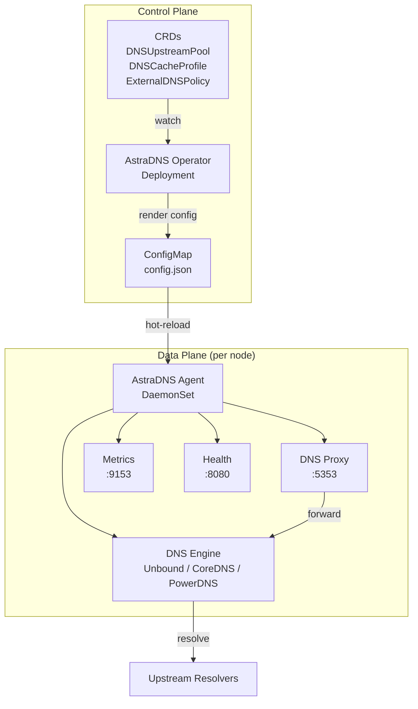

# Architecture Overview

AstraDNS deploys a **DNS resolver plane** alongside your Kubernetes cluster, giving platform teams full control over how workloads resolve external domains.

## The Problem

Today, when a pod resolves `api.stripe.com`, the query goes through CoreDNS to the upstream resolver configured by the cloud provider. Platform teams have:

- **No visibility** into what's being resolved, how often, or how slow
- **No security controls** over which workloads can resolve which domains
- **No caching control** to reduce DNS latency and egress costs

## The Solution

AstraDNS introduces two components:

### Control Plane: Operator

A single-replica Deployment that:

1. Watches three CRDs for configuration changes
2. Assembles an engine-agnostic `EngineConfig` from CRD specs
3. Renders engine-specific configuration (Unbound conf, Corefile, or recursor.conf)
4. Writes the rendered config to a ConfigMap
5. Sets status conditions on CRDs (Ready, Superseded, InvalidSpec)

### Data Plane: Agent

A DaemonSet running on every node that:

1. Starts a pluggable DNS engine as a subprocess (default: Unbound)
2. Runs a DNS proxy on port 5353 that intercepts all queries
3. Forwards queries to the engine on port 5354
4. Emits per-query events to a metrics collector and query logger
5. Watches the ConfigMap for changes and hot-reloads the engine
6. Health-checks upstream resolvers and exposes status via `/healthz` and `/readyz`

## Design Principles

**Kubernetes-native**
:   All configuration is declarative via CRDs. No imperative APIs, no CLI tools, no external databases.

**Safe by default**
:   AstraDNS failure must not break DNS. CoreDNS retains its original upstream as fallback. The agent proxy returns SERVFAIL on engine failure, which triggers retry at the CoreDNS level.

**Observable from day 1**
:   Every query is metered. Prometheus metrics, structured logs, and Grafana dashboards are first-class features, not afterthoughts.

**Minimal blast radius**
:   Each node has its own agent and cache. A failure on one node does not affect others.

**Pluggable engine**
:   The DNS engine is an implementation detail behind a Go interface. Swap Unbound for CoreDNS without changing CRDs or the agent proxy layer.
