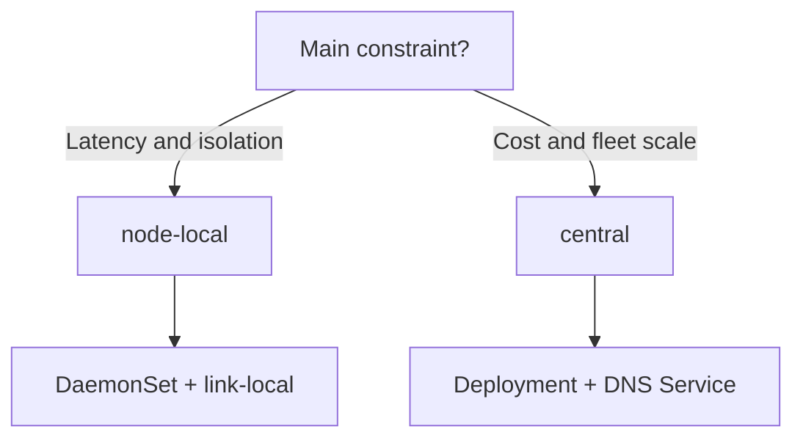

# Agent Topology Profiles

AstraDNS provides two Agent topology profiles:

- `node-local` (default): DaemonSet on eligible nodes, local forwarding.
- `central`: Deployment with fixed replicas behind a DNS Service.

This guide helps you choose the right profile and understand practical trade-offs across latency, cost, cache behavior, and operational risk.

---

## Executive summary

If you need a quick decision:

- **Choose `node-local`** when ultra-low latency and node-level isolation matter most.
- **Choose `central`** when cluster size makes per-node Agent pods expensive.



---

## Why only two profiles

An intermediate `dns-pool` profile looks attractive at first, but in practice it behaves like central mode with node affinity:

- cluster-wide benefit still requires Service-based routing;
- pool pinning can be expressed via Deployment affinity;
- a third profile increases chart complexity without a proportional operational gain.

So the recommended model is intentionally compact:

1. `node-local`
2. `central`

---

## Decision matrix

| Factor | `node-local` | `central` |
|---|---|---|
| Kubernetes workload kind | DaemonSet | Deployment |
| DNS routing | link-local/hostPort per node | ClusterIP Service |
| Typical latency | sub-ms to ~1 ms | ~1-2 ms intra-cluster |
| Memory footprint | scales with node count | scales with replica count |
| Cache scope | per node (isolated) | per replica (shared) |
| Failure blast radius | single node | replica set |
| Scaling model | add/remove nodes | change `replicas` |

!!! tip "Rule of thumb"
    Small/medium latency-sensitive clusters usually fit `node-local`.
    Large cost-optimized fleets usually fit `central`.

---

## `node-local` profile (default)

In `node-local`, each eligible node runs its own Agent.

```text
Pod -> CoreDNS -> 169.254.20.11:53 (local Agent) -> Engine -> Upstream
```

### Minimal configuration

```yaml
agent:
  topology:
    profile: node-local
  network:
    mode: linkLocal
    linkLocalIP: 169.254.20.11

clusterDNS:
  forwardExternalToAstraDNS:
    enabled: true
    forwardTarget: 169.254.20.11:5353
```

### Best fit scenarios

- latency-sensitive workloads;
- strict per-node cache isolation;
- environments that prioritize single-node fault isolation.

---

## `central` profile

In `central`, Agent runs as a Deployment behind a DNS Service exposing UDP/TCP 53.

```text
Pod -> CoreDNS -> AstraDNS DNS Service -> Agent Deployment -> Engine -> Upstream
```

### Recommended baseline

```yaml
agent:
  topology:
    profile: central

  deployment:
    replicas: 3
    strategy:
      type: RollingUpdate
    topologySpreadConstraints:
      - maxSkew: 1
        topologyKey: kubernetes.io/hostname
        whenUnsatisfiable: DoNotSchedule

  dnsService:
    type: ClusterIP
    port: 53
    sessionAffinity: ClientIP
    sessionAffinityTimeoutSeconds: 1800
```

### CoreDNS target strategy in `central`

The chart uses this precedence:

1. If `agent.dnsService.clusterIP` is set, CoreDNS forwards to the fixed IP.
2. If it is empty, the patch job discovers Service `clusterIP` at runtime.

This lets you keep an explicit, stable target in production while retaining a safe auto mode.

### Best fit scenarios

- large clusters where per-node Agents are expensive;
- centralized DNS operations;
- environments that prefer replica-based scaling.

---

## Cache and session affinity

In `central`, `sessionAffinity: ClientIP` improves cache warmth by consistently routing the same client IP to the same Agent replica.

- `ClientIP`: better cache hit ratio, controlled rebalance.
- `None`: more even load, less cache locality.

Recommended default: `ClientIP` with `1800` seconds timeout.

---

## Helm guardrails

The chart blocks unsafe combinations:

| Condition | Result |
|---|---|
| `profile=central` + `network.mode=linkLocal` | template `fail` |
| `profile=node-local` + CoreDNS patch + `network.mode!=linkLocal` | template `fail` |
| `profile=central` + PDB | `minAvailable: 1` |
| `profile=central` + missing spread settings | hostname spread defaults are applied |

!!! warning "HA in central"
    `replicas: 1` removes high availability.
    For production, keep `replicas >= 2`.

---

## Zero-downtime migration

### node-local -> central

1. Deploy `central` in parallel.
2. Verify the Agent DNS Service and pod readiness.
3. Patch CoreDNS to point to the central target.
4. Observe DNS metrics for 30-60 minutes.
5. Disable node-local.

### central -> node-local

1. Deploy node-local DaemonSet.
2. Validate node coverage for workload nodes.
3. Patch CoreDNS back to link-local target.
4. Verify latency/error stability.
5. Remove central Deployment.

---

## Post-change validation checklist

```bash
# 1) CoreDNS points to the expected target
kubectl -n kube-system get configmap coredns -o jsonpath='{.data.Corefile}'

# 2) Agent pods are healthy
kubectl -n astradns-system get pods -l app.kubernetes.io/component=agent

# 3) DNS Service exists (central only)
kubectl -n astradns-system get svc <release>-astradns-agent-dns

# 4) DNS smoke test from workload perspective
kubectl run dns-test --rm -it --restart=Never --image=busybox:1.37 -- nslookup example.com
```

Monitor for at least the first hour:

- `astradns_queries_total`
- `astradns_upstream_latency_seconds`
- `astradns_upstream_failures_total`
- `astradns_cache_hits_total`
- `astradns_servfail_total`

---

## Related

- [ADR-009: Agent Topology Profiles](../decisions/adr-009.md)
- [ADR-001: Data Path Interception](../decisions/adr-001.md)
- [Production Deployment](production-deployment.md)
