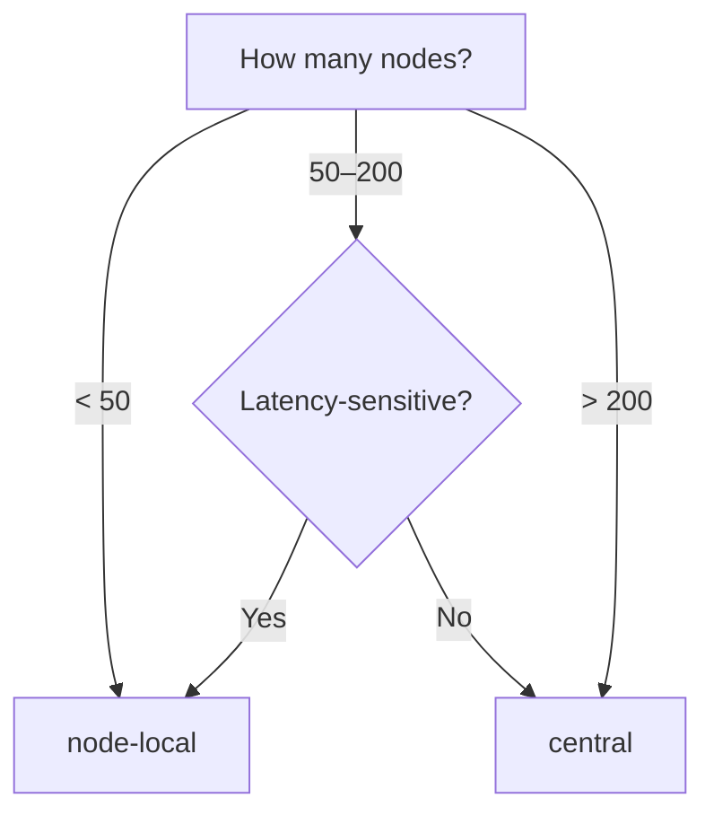

# Topology Profiles

AstraDNS supports two deployment topologies for the Agent, allowing you to balance latency against resource cost.

## Choosing a Profile



| Factor | node-local | central |
|--------|-----------|---------|
| Cluster size | Any (optimal < 100) | 50+ nodes |
| DNS latency | < 1 ms | ~1–2 ms |
| Memory overhead | 128 Mi × N nodes | 128 Mi × replicas |
| Cache isolation | Per-node | Per-replica (shared) |
| Failure blast radius | Single node | Replica set |

## node-local (Default)

The default profile deploys the Agent as a DaemonSet on every eligible node. Each pod binds to the link-local address `169.254.20.11` and CoreDNS on each node forwards to it.

```
Pod → CoreDNS → 169.254.20.11:53 (Agent DaemonSet) → Engine → Upstream
```

This is the same architecture from [ADR-001](../decisions/adr-001.md). No additional configuration is needed.

```yaml
agent:
  topology:
    profile: node-local  # this is the default
```

### When to use

- Small to medium clusters (< 100 nodes)
- Workloads that are latency-sensitive (financial, real-time)
- Environments where per-node cache isolation is a requirement

## central

The `central` profile deploys the Agent as a Deployment with a fixed replica count, fronted by a ClusterIP Service. CoreDNS forwards to the Service FQDN instead of a link-local IP.

```
Pod → CoreDNS → astradns-agent-dns.astradns-system.svc.cluster.local:53 (Service) → Agent Deployment → Engine → Upstream
```

```yaml
agent:
  topology:
    profile: central

  deployment:
    replicas: 3
    strategy:
      type: RollingUpdate
    topologySpreadConstraints:
      - maxSkew: 1
        topologyKey: kubernetes.io/hostname
        whenUnsatisfiable: DoNotSchedule

  dnsService:
    type: ClusterIP
    port: 53
    sessionAffinity: ClientIP
    sessionAffinityTimeoutSeconds: 1800
```

### When to use

- Large clusters (100+ nodes) where per-node DNS pods are wasteful
- Cost-optimized environments willing to accept ~1–2 ms latency
- Multi-tenant platforms where centralized DNS management is preferred

### Sizing guide

| Cluster nodes | Recommended replicas | Estimated memory |
|--------------|---------------------|-----------------|
| 50–100 | 2 | 256 Mi |
| 100–300 | 3 | 384 Mi |
| 300–1000 | 5 | 640 Mi |
| 1000+ | 7–10 | 896 Mi – 1.28 Gi |

These are starting points. Monitor `astradns_queries_total` per replica and scale based on actual query rate.

### Session affinity

`sessionAffinity: ClientIP` ensures that queries from the same source IP consistently hit the same Agent replica. This keeps each replica's cache warm for its set of clients, improving hit ratio without sacrificing failover — if a replica goes down, kube-proxy automatically routes to another.

The default timeout (1800s / 30 min) balances cache warmth against re-balancing after scaling events.

## Guardrails

The Helm chart enforces compatibility:

| Condition | Behavior |
|-----------|----------|
| `profile=central` + `network.mode=linkLocal` | `fail` — link-local requires a DaemonSet on every node |
| `profile=central` with `replicas < 2` | Warning in NOTES.txt (no HA) |
| `profile=central` without `topologySpreadConstraints` | Default spread by hostname applied |
| `profile=central` | PDB created with `minAvailable: 1` |

## CoreDNS integration

In `node-local` mode, the CoreDNS patch job configures forwarding to `169.254.20.11`.

In `central` mode, it configures forwarding to the Service FQDN:

```
forward . astradns-agent-dns.astradns-system.svc.cluster.local:53
```

!!! note "No circular dependency"
    CoreDNS resolves `.svc.cluster.local` names via its built-in `kubernetes` plugin, which watches the Kubernetes API directly. It does **not** use DNS forwarding to resolve Service names, so there is no circular dependency.

## Migrating from node-local to central

1. **Deploy central alongside node-local** — install a second release with `profile=central` in a different namespace to validate behavior.

2. **Verify DNS resolution** through the central Service:
    ```bash
    kubectl run dns-test --rm -it --restart=Never --image=busybox:1.37 -- \
      nslookup example.com astradns-agent-dns.astradns-system.svc.cluster.local
    ```

3. **Switch the profile** in your primary release:
    ```yaml
    agent:
      topology:
        profile: central
      deployment:
        replicas: 3
    ```

4. **Apply and monitor**:
    ```bash
    helm upgrade astradns astradns/astradns -f values.yaml -n astradns-system
    ```

5. **Watch metrics** for the first hour:
    - `astradns_queries_total` — verify traffic is flowing
    - `astradns_upstream_latency_seconds` — compare p95 against baseline
    - `astradns_cache_hits_total` — confirm cache is warming up

## Related

- [ADR-009: Agent Topology Profiles](../decisions/adr-009.md) — the decision record
- [ADR-001: Data Path Interception](../decisions/adr-001.md) — the original NodeLocal DNS pattern
- [Production Deployment](production-deployment.md) — general production checklist
