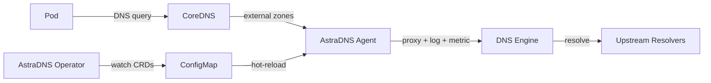

---
hide:
  - navigation
---

# AstraDNS

**Visibility, security, and cost control over external DNS in Kubernetes.**

---

Kubernetes clusters make thousands of external DNS queries every minute — to package registries, SaaS APIs, databases, and third-party services. Today, these queries leave the cluster with **zero visibility**, **no security controls**, and **no caching**.

AstraDNS deploys a managed DNS resolver plane on every node, giving platform teams full control over external DNS resolution.

<div class="grid cards" markdown>

-   :material-chart-line:{ .lg .middle } **Observability**

    ---

    Per-node metrics, structured query logs, and Grafana dashboards. Know exactly what your workloads are resolving, how fast, and where failures happen.

-   :material-shield-check:{ .lg .middle } **Security**

    ---

    Global domain allow/deny lists with wildcard patterns, configurable deny action (REFUSED or NXDOMAIN), and hot-reloadable rules via CRD. Control which domains your cluster can resolve.

-   :material-currency-usd:{ .lg .middle } **Cost Optimization**

    ---

    Intelligent caching with configurable TTLs and prefetch. Reduce egress DNS traffic by 40-70% with measurable cache hit ratios.

-   :material-kubernetes:{ .lg .middle } **Kubernetes-Native**

    ---

    Fully declarative via CRDs. Install with a single `helm install`, configure with YAML. No sidecars, no iptables rules, no code changes.

</div>

## How It Works



1. **Operator** watches CRDs (`DNSUpstreamPool`, `DNSCacheProfile`, `ExternalDNSPolicy`) and renders engine configuration into a ConfigMap.
2. **Agent** runs as a DaemonSet on every node, proxying DNS queries through a pluggable DNS engine (Unbound, CoreDNS, or PowerDNS).
3. Every query is logged, metered, and health-checked — without touching your application code.

## Quick Start

```bash
helm install astradns deploy/helm/astradns \
  --namespace astradns-system --create-namespace \
  --set agent.network.mode=linkLocal \
  --set coredns.integration.enabled=true
```

Then create your first upstream pool:

```yaml
apiVersion: dns.astradns.com/v1alpha1
kind: DNSUpstreamPool
metadata:
  name: production
  namespace: astradns-system
spec:
  upstreams:
    - address: "1.1.1.1"
    - address: "8.8.8.8"
  healthCheck:
    enabled: true
    intervalSeconds: 30
  loadBalancing:
    strategy: round-robin
```

[:octicons-arrow-right-24: Getting Started](getting-started/index.md){ .md-button .md-button--primary }
[:octicons-book-24: Architecture](architecture/index.md){ .md-button }
