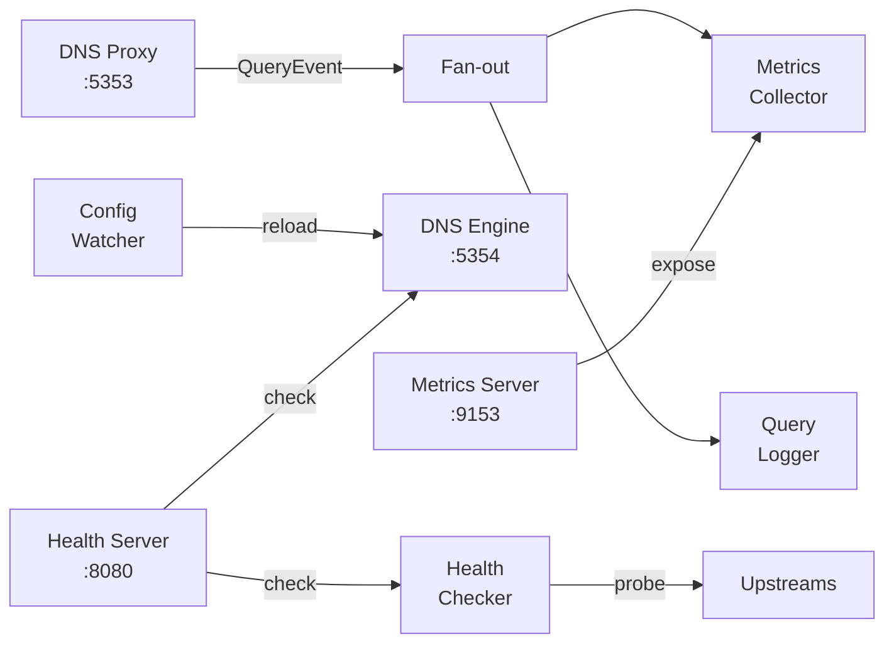

# Componentes

AstraDNS consiste en cuatro componentes principales distribuidos en dos planos.

## Operator

| Propiedad | Valor |
|-----------|-------|
| Kind | Deployment |
| Réplicas | 1 (con elección de líder para HA) |
| Imagen | `astradns/operator` |
| Puertos | 8081 (health), 8443 (metrics), 9443 (webhook) |

El operator ejecuta tres controladores:

### Controlador de DNSUpstreamPool

Observa los recursos `DNSUpstreamPool` y renderiza la configuración del motor.

**Flujo de reconciliación:**

1. Validar la especificación del pool (direcciones, puertos)
2. Estampar la anotación `dns.astradns.com/initial-resource-version` en la primera reconciliación
3. Seleccionar el pool activo (el más antiguo por timestamp de creación, luego por RV inicial, luego por nombre)
4. Obtener el `default` DNSCacheProfile (si existe)
5. Generar el `EngineConfig` agnóstico del motor
6. Validar renderizando a través del renderer del motor activo
7. Serializar como JSON y escribir en el ConfigMap
8. Establecer la condición `Ready=True` en el pool activo
9. Establecer `Ready=False, Reason=Superseded` en los pools no activos

### Controlador de DNSCacheProfile

Valida la configuración de caché y establece la condición `Active`. El perfil llamado `default` es utilizado automáticamente por el controlador del pool de upstreams.

### Controlador de ExternalDNSPolicy

Valida las referencias cruzadas a pools de upstreams y perfiles de caché. Establece las condiciones `Validated=True/False`.

## Agent

| Propiedad | Valor |
|-----------|-------|
| Kind | DaemonSet |
| Imagen | `astradns/agent` |
| Puertos | 5353 (DNS), 8080 (health), 9153 (metrics) |

El agent ejecuta siete componentes en goroutines paralelas:



| Componente | Responsabilidad |
|------------|----------------|
| **DNS Proxy** | Intercepta consultas en :5353 (UDP+TCP), las reenvía al motor en :5354, emite QueryEvent |
| **Metrics Collector** | Consume QueryEvents, actualiza contadores/histogramas de Prometheus |
| **Query Logger** | Consume QueryEvents, escribe JSON estructurado a stdout |
| **Health Checker** | Sondea los resolvers upstream periódicamente (UDP con fallback a TCP) |
| **Config Watcher** | Observa el directorio del ConfigMap mediante fsnotify, dispara la recarga del motor |
| **Health Server** | Servidor HTTP que expone `/healthz` (motor vivo) y `/readyz` (motor + upstreams) |
| **Metrics Server** | Servidor HTTP que expone `/metrics` en formato Prometheus |

## CRDs

Tres Custom Resource Definitions en el grupo de API `dns.astradns.com`:

| CRD | Propósito | Alcance |
|-----|-----------|---------|
| `DNSUpstreamPool` | Definir resolvers upstream, verificaciones de salud, balanceo de carga | Namespaced |
| `DNSCacheProfile` | Configurar tamaño de caché, límites de TTL, prefetch | Namespaced |
| `ExternalDNSPolicy` | Mapear namespaces a pools y perfiles de caché | Namespaced |

Consulte la [Referencia de CRDs](../reference/crds/index.md) para la documentación completa de campos.

## Motor DNS

El motor es un subproceso administrado por el agent. Se soportan tres motores:

| Motor | Archivo de Configuración | Método de Recarga | Por Defecto |
|-------|--------------------------|-------------------|-------------|
| **Unbound** | `unbound.conf` | `unbound-control reload` | Sí |
| **CoreDNS** | `Corefile` | Plugin de auto-reload | No |
| **PowerDNS Recursor** | `recursor.conf` | `rec_control reload-zones` | No |

Todos los motores implementan la misma interfaz de Go:

```go
type Engine interface {
    Configure(ctx context.Context, config EngineConfig) (string, error)
    Start(ctx context.Context) error
    Reload(ctx context.Context) error
    Stop(ctx context.Context) error
    HealthCheck(ctx context.Context) (bool, error)
    Name() EngineType
}
```

Consulte [Selección de Motor](engine-selection.md) para orientación sobre cómo elegir un motor.
