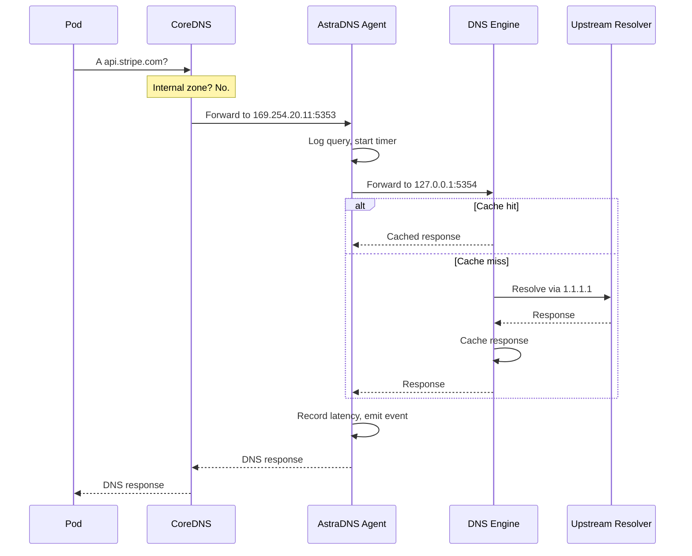

# Ruta de Datos

Comprender cómo fluyen las consultas DNS a través de AstraDNS es fundamental para la depuración, la planificación de capacidad y el análisis de seguridad.

## Flujo de Consultas



## Modos de Red

### hostPort (por defecto)

El agent se enlaza al puerto `5353` en la IP principal del nodo mediante `hostPort` de Kubernetes.

```
Pod → CoreDNS → Node:5353 (agent) → 127.0.0.1:5354 (engine) → upstream
```

- Fácil de configurar
- No requiere host network
- CoreDNS debe configurarse para reenviar a `<nodeIP>:5353`

### linkLocal (recomendado)

Por defecto, el agent se enlaza a la dirección link-local `169.254.20.11:5353` usando `hostNetwork: true`.

```
Pod → CoreDNS → <linkLocalIP>:5353 (agent) → 127.0.0.1:5354 (engine) → upstream
```

- Dirección y puerto estables en todos los nodos
- Dirección configurada consistente en todos los nodos
- CoreDNS reenvía a una sola dirección independientemente de la IP del nodo
- Sigue el patrón establecido de NodeLocal DNS Cache

!!! tip "Recomendación para producción"
    Use el modo linkLocal con la integración de CoreDNS habilitada. Esta es la configuración más confiable y ampliamente probada.

## Comportamiento del Caché

Cada nodo mantiene su propio caché. No hay caché compartido entre nodos.

| Propiedad | Controlado Por |
|-----------|---------------|
| Entradas máximas | `DNSCacheProfile.spec.maxEntries` |
| TTL positivo mínimo | `DNSCacheProfile.spec.positiveTtl.minSeconds` |
| TTL positivo máximo | `DNSCacheProfile.spec.positiveTtl.maxSeconds` |
| TTL negativo | `DNSCacheProfile.spec.negativeTtl.seconds` |
| Prefetch | `DNSCacheProfile.spec.prefetch.enabled` |
| Umbral de prefetch | `DNSCacheProfile.spec.prefetch.threshold` |

!!! info "Aislamiento de caché por nodo"
    El caché está aislado por nodo. Una consulta almacenada en caché en el Nodo A no está disponible en el Nodo B. Esta es una decisión de diseño deliberada para el aislamiento de fallas: un caché contaminado en un nodo no se propaga a los demás.

## Modos de Falla

| Falla | Comportamiento | Recuperación |
|-------|---------------|--------------|
| El pod del agent se cae | CoreDNS reintenta con el upstream de respaldo | Reinicio del agent mediante DaemonSet/Deployment |
| El subproceso del motor muere | `/healthz` devuelve 503, el pod se reinicia | Automática mediante liveness probe |
| Upstream inalcanzable | El health checker lo marca como no saludable, se devuelve SERVFAIL | Automática cuando el upstream se recupera |
| ConfigMap inválido | La recarga falla, se mantiene la configuración anterior | Corrija el CRD, el operator re-renderiza |
| Operator caído | No se procesan cambios de configuración, la configuración existente continúa | El operator se reinicia mediante Deployment |

## Soporte de Protocolos

| Característica | Estado |
|----------------|--------|
| Consultas UDP | Soportado |
| Consultas TCP | Soportado |
| EDNS | Passthrough |
| DNSSEC | Passthrough (el motor valida si está configurado) |
| DNS-over-TLS | No soportado (planificado) |
| DNS-over-HTTPS | No soportado (planificado) |
