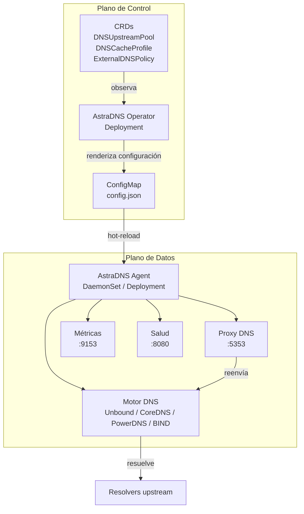

# Descripción General de la Arquitectura

AstraDNS despliega un **plano de resolución DNS** junto a su clúster de Kubernetes, brindando a los equipos de plataforma control total sobre cómo las cargas de trabajo resuelven dominios externos.

## El Problema

Hoy, cuando un pod resuelve `api.stripe.com`, la consulta pasa por CoreDNS hacia el resolver upstream configurado por el proveedor de nube. Los equipos de plataforma no tienen:

- **Ninguna visibilidad** sobre qué se está resolviendo, con qué frecuencia o qué tan lento
- **Ningún control de seguridad** sobre qué cargas de trabajo pueden resolver qué dominios
- **Ningún control de caché** para reducir la latencia DNS y los costos de salida

## La Solución

AstraDNS introduce dos componentes:

### Plano de Control: Operator

Un Deployment de una sola réplica que:

1. Observa tres CRDs en busca de cambios de configuración
2. Ensambla un `EngineConfig` agnóstico del motor a partir de las especificaciones de los CRDs
3. Renderiza configuración específica del motor (conf de Unbound, Corefile, recursor.conf o named.conf)
4. Escribe la configuración renderizada en un ConfigMap
5. Establece condiciones de estado en los CRDs (Ready, Superseded, InvalidSpec)

### Plano de Datos: Agent

Una carga que corre como DaemonSet (`node-local`) o Deployment (`central`) y que:

1. Inicia un motor DNS intercambiable como subproceso (por defecto: Unbound)
2. Ejecuta un proxy DNS en el puerto 5353 que intercepta todas las consultas
3. Reenvía las consultas al motor en el puerto 5354
4. Emite eventos por consulta hacia un recolector de métricas y un registrador de consultas
5. Observa el ConfigMap en busca de cambios y recarga el motor en caliente
6. Verifica la salud de los resolvers upstream y expone el estado mediante `/healthz` y `/readyz`

## Principios de Diseño

**Nativo de Kubernetes**
:   Toda la configuración es declarativa mediante CRDs. Sin APIs imperativas, sin herramientas CLI, sin bases de datos externas.

**Seguro por defecto**
:   Una falla de AstraDNS no debe romper el DNS. CoreDNS mantiene su upstream original como respaldo. El proxy del agent devuelve SERVFAIL ante una falla del motor, lo que activa un reintento a nivel de CoreDNS.

**Observable desde el día 1**
:   Cada consulta se mide. Las métricas de Prometheus, los registros estructurados y los dashboards de Grafana son características de primera clase, no agregados posteriores.

**Radio de impacto mínimo**
:   Cada nodo tiene su propio agent y caché. Una falla en un nodo no afecta a los demás.

**Motor intercambiable**
:   El motor DNS es un detalle de implementación detrás de una interfaz de Go. Cambie Unbound por CoreDNS sin modificar los CRDs ni la capa de proxy del agent.
