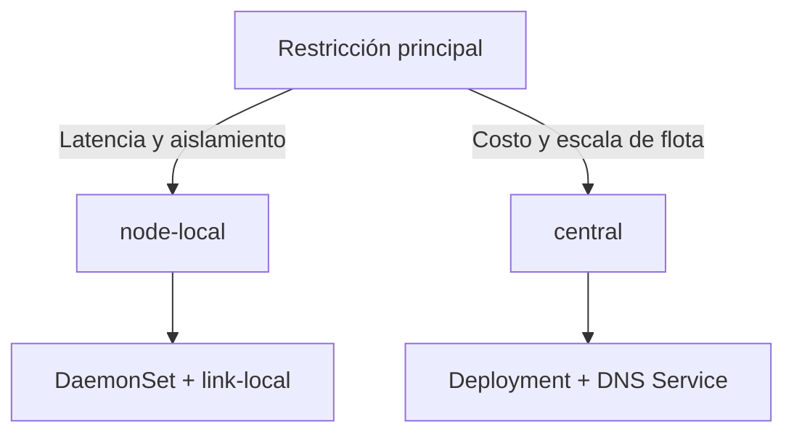

# Perfiles de Topología del Agent

AstraDNS ofrece dos perfiles de topología para el Agent:

- `node-local` (predeterminado): DaemonSet en nodos elegibles y reenvío local.
- `central`: Deployment con réplicas fijas detrás de un Service DNS.

Esta guía te ayuda a elegir el perfil correcto y a entender los trade-offs de latencia, costo, comportamiento de caché y riesgo operativo.

---

## Resumen ejecutivo

Si necesitas decidir rápido:

- **Elige `node-local`** cuando la latencia ultra-baja y el aislamiento por nodo son prioridad.
- **Elige `central`** cuando el tamaño del clúster vuelve caro ejecutar un Agent por nodo.



---

## Por qué solo dos perfiles

Un perfil intermedio `dns-pool` parece atractivo al inicio, pero en la práctica se comporta como `central` con afinidad de nodos:

- el beneficio a nivel clúster sigue requiriendo enrutamiento por Service;
- el pinning de pools puede expresarse con afinidad del Deployment;
- un tercer perfil aumenta la complejidad del chart sin una ganancia operativa proporcional.

Por eso el modelo recomendado se mantiene intencionalmente simple:

1. `node-local`
2. `central`

---

## Matriz de decisión

| Factor | `node-local` | `central` |
|---|---|---|
| Tipo de workload Kubernetes | DaemonSet | Deployment |
| Enrutamiento DNS | link-local/hostPort por nodo | Service ClusterIP |
| Latencia típica | sub-ms a ~1 ms | ~1-2 ms intra-clúster |
| Huella de memoria | escala con cantidad de nodos | escala con cantidad de réplicas |
| Alcance de caché | por nodo (aislado) | por réplica (compartido) |
| Radio de falla | nodo individual | set de réplicas |
| Modelo de escalado | agregar/quitar nodos | ajustar `replicas` |

!!! tip "Regla práctica"
    Clústeres pequeños/medianos sensibles a latencia suelen encajar en `node-local`.
    Flotas grandes orientadas a costo suelen encajar en `central`.

---

## Perfil `node-local` (predeterminado)

En `node-local`, cada nodo elegible ejecuta su propio Agent.

```text
Pod -> CoreDNS -> 169.254.20.11:5353 (Agent local) -> Engine -> Upstream
```

### Configuración mínima

```yaml
agent:
  topology:
    profile: node-local
  network:
    mode: linkLocal
    linkLocalIP: 169.254.20.11

clusterDNS:
  forwardExternalToAstraDNS:
    enabled: true
    forwardTarget: 169.254.20.11:5353
```

### Cuándo conviene

- cargas sensibles a latencia;
- aislamiento estricto de caché por nodo;
- entornos que priorizan aislamiento de fallas por nodo.

---

## Perfil `central`

En `central`, el Agent corre como Deployment detrás de un Service DNS que expone UDP/TCP 53.

```text
Pod -> CoreDNS -> Service DNS de AstraDNS -> Deployment del Agent -> Engine -> Upstream
```

### Línea base recomendada

```yaml
agent:
  topology:
    profile: central

  deployment:
    replicas: 3
    strategy:
      type: RollingUpdate
    topologySpreadConstraints:
      - maxSkew: 1
        topologyKey: kubernetes.io/hostname
        whenUnsatisfiable: DoNotSchedule

  dnsService:
    type: ClusterIP
    port: 53
    sessionAffinity: ClientIP
    sessionAffinityTimeoutSeconds: 1800
```

### Estrategia de target CoreDNS en `central`

El chart aplica esta precedencia:

1. Si `agent.dnsService.clusterIP` está definido, CoreDNS reenvía a esa IP fija.
2. Si está vacío, el job de patch descubre el `clusterIP` del Service en tiempo de ejecución.

Esto permite un target explícito y estable en producción, sin perder un modo automático seguro.

### Cuándo conviene

- clústeres grandes donde un Agent por nodo resulta caro;
- operación DNS centralizada;
- entornos que prefieren escalado basado en réplicas.

---

## Caché y afinidad de sesión

En `central`, `sessionAffinity: ClientIP` mejora el calentamiento de caché al enrutar la misma IP cliente hacia la misma réplica.

- `ClientIP`: mejor hit ratio de caché, rebalanceo más controlado.
- `None`: carga más uniforme, menor localidad de caché.

Predeterminado recomendado: `ClientIP` con timeout de `1800` segundos.

---

## Guardrails de Helm

El chart bloquea combinaciones no seguras:

| Condición | Resultado |
|---|---|
| `profile=central` + `network.mode=linkLocal` | `fail` en template |
| `profile=node-local` + patch de CoreDNS + `network.mode!=linkLocal` | `fail` en template |
| `profile=central` + PDB | `minAvailable: 1` |
| `profile=central` + sin spread settings | se aplican defaults por hostname |

!!! warning "Alta disponibilidad en central"
    `replicas: 1` elimina alta disponibilidad.
    Para producción, usa `replicas >= 2`.

---

## Migración sin downtime

### node-local -> central

1. Despliega `central` en paralelo.
2. Verifica el Service DNS del Agent y la readiness de pods.
3. Aplica patch en CoreDNS para apuntar al target central.
4. Observa métricas DNS durante 30-60 minutos.
5. Desactiva `node-local`.

### central -> node-local

1. Despliega el DaemonSet `node-local`.
2. Valida cobertura de nodos para workloads.
3. Reconfigura CoreDNS al target link-local.
4. Verifica estabilidad de latencia y errores.
5. Elimina el Deployment central.

---

## Checklist de validación posterior

```bash
# 1) CoreDNS apunta al target esperado
kubectl -n kube-system get configmap coredns -o jsonpath='{.data.Corefile}'

# 2) Pods del Agent en estado sano
kubectl -n astradns-system get pods -l app.kubernetes.io/component=agent

# 3) Service DNS existe (solo central)
kubectl -n astradns-system get svc <helm-fullname>-agent-dns

# 4) Prueba de humo DNS desde perspectiva de workload
kubectl run dns-test --rm -it --restart=Never --image=busybox:1.37 -- nslookup example.com
```

Monitorea al menos durante la primera hora:

- `astradns_queries_total`
- `astradns_upstream_latency_seconds`
- `astradns_upstream_failures_total`
- `astradns_cache_hits_total`
- `astradns_servfail_total`

---

## Relacionado

- [ADR-009: Perfiles de Topología del Agent](../decisions/adr-009.md)
- [ADR-001: Intercepción del Data Path](../decisions/adr-001.md)
- [Despliegue en Producción](production-deployment.md)
