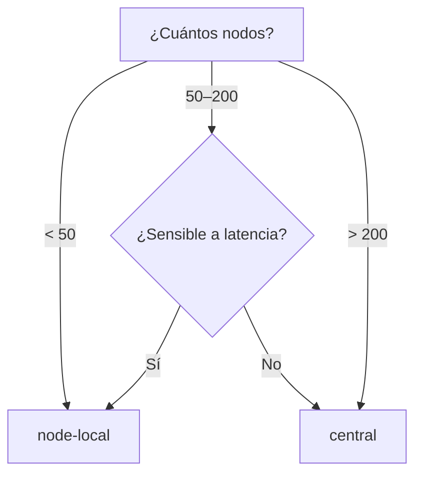

# Perfiles de Topología

AstraDNS soporta dos topologías de despliegue para el Agent, permitiendo equilibrar latencia contra costo de recursos.

## Eligiendo un Perfil



| Factor | node-local | central |
|--------|-----------|---------|
| Tamaño del cluster | Cualquiera (ideal < 100) | 50+ nodos |
| Latencia DNS | < 1 ms | ~1–2 ms |
| Overhead de memoria | 128 Mi × N nodos | 128 Mi × réplicas |
| Aislamiento de caché | Por nodo | Por réplica (compartido) |
| Radio de falla | Nodo individual | Conjunto de réplicas |

## node-local (Predeterminado)

El perfil predeterminado despliega el Agent como un DaemonSet en cada nodo elegible. Cada pod se vincula a la dirección link-local `169.254.20.11` y CoreDNS en cada nodo reenvía hacia él.

```
Pod → CoreDNS → 169.254.20.11:53 (Agent DaemonSet) → Engine → Upstream
```

Esta es la misma arquitectura del [ADR-001](../decisions/adr-001.md). No se necesita configuración adicional.

```yaml
agent:
  topology:
    profile: node-local  # este es el predeterminado
```

### Cuándo usar

- Clusters pequeños a medianos (< 100 nodos)
- Cargas de trabajo sensibles a latencia (financiero, tiempo real)
- Ambientes donde el aislamiento de caché por nodo es un requisito

## central

El perfil `central` despliega el Agent como un Deployment con una cantidad fija de réplicas, detrás de un Service ClusterIP. CoreDNS reenvía al FQDN del Service en lugar de una IP link-local.

```
Pod → CoreDNS → astradns-agent-dns.astradns-system.svc.cluster.local:53 (Service) → Agent Deployment → Engine → Upstream
```

```yaml
agent:
  topology:
    profile: central

  deployment:
    replicas: 3
    strategy:
      type: RollingUpdate
    topologySpreadConstraints:
      - maxSkew: 1
        topologyKey: kubernetes.io/hostname
        whenUnsatisfiable: DoNotSchedule

  dnsService:
    type: ClusterIP
    port: 53
    sessionAffinity: ClientIP
    sessionAffinityTimeoutSeconds: 1800
```

### Cuándo usar

- Clusters grandes (100+ nodos) donde pods DNS por nodo son un desperdicio
- Ambientes optimizados para costo dispuestos a aceptar ~1–2 ms de latencia
- Plataformas multi-tenant donde la gestión centralizada de DNS es preferida

### Guía de dimensionamiento

| Nodos del cluster | Réplicas recomendadas | Memoria estimada |
|------------------|----------------------|-----------------|
| 50–100 | 2 | 256 Mi |
| 100–300 | 3 | 384 Mi |
| 300–1000 | 5 | 640 Mi |
| 1000+ | 7–10 | 896 Mi – 1.28 Gi |

Estos son puntos de partida. Monitoree `astradns_queries_total` por réplica y escale según la tasa real de consultas.

### Afinidad de sesión

`sessionAffinity: ClientIP` asegura que las consultas de la misma IP de origen siempre lleguen a la misma réplica del Agent. Esto mantiene el caché de cada réplica caliente para sus clientes, mejorando la tasa de aciertos sin sacrificar failover — si una réplica cae, kube-proxy rutea automáticamente a otra.

El timeout predeterminado (1800s / 30 min) equilibra el calentamiento del caché con el rebalanceo después de eventos de escalamiento.

## Guardrails

El chart Helm aplica compatibilidad:

| Condición | Comportamiento |
|-----------|----------------|
| `profile=central` + `network.mode=linkLocal` | `fail` — link-local requiere DaemonSet en cada nodo |
| `profile=central` con `replicas < 2` | Advertencia en NOTES.txt (sin HA) |
| `profile=central` sin `topologySpreadConstraints` | Spread predeterminado por hostname aplicado |
| `profile=central` | PDB creado con `minAvailable: 1` |

## Integración CoreDNS

En modo `node-local`, el job de patch de CoreDNS configura reenvío a `169.254.20.11`.

En modo `central`, configura reenvío al FQDN del Service:

```
forward . astradns-agent-dns.astradns-system.svc.cluster.local:53
```

!!! note "Sin dependencia circular"
    CoreDNS resuelve nombres `.svc.cluster.local` mediante su plugin `kubernetes` integrado, que observa la API de Kubernetes directamente. **No** usa reenvío DNS para resolver nombres de Service, por lo tanto no hay dependencia circular.

## Migración de node-local a central

1. **Despliegue central junto a node-local** — instale un segundo release con `profile=central` en un namespace diferente para validar el comportamiento.

2. **Verifique la resolución DNS** a través del Service central:
    ```bash
    kubectl run dns-test --rm -it --restart=Never --image=busybox:1.37 -- \
      nslookup example.com astradns-agent-dns.astradns-system.svc.cluster.local
    ```

3. **Cambie el perfil** en su release principal:
    ```yaml
    agent:
      topology:
        profile: central
      deployment:
        replicas: 3
    ```

4. **Aplique y monitoree**:
    ```bash
    helm upgrade astradns astradns/astradns -f values.yaml -n astradns-system
    ```

5. **Observe las métricas** durante la primera hora:
    - `astradns_queries_total` — verifique que el tráfico está fluyendo
    - `astradns_upstream_latency_seconds` — compare p95 con el baseline
    - `astradns_cache_hits_total` — confirme que el caché se está calentando

## Relacionados

- [ADR-009: Perfiles de Topología del Agent](../decisions/adr-009.md) — el registro de decisión
- [ADR-001: Intercepción de la Ruta de Datos](../decisions/adr-001.md) — el patrón NodeLocal DNS original
- [Despliegue en Producción](production-deployment.md) — checklist general de producción
