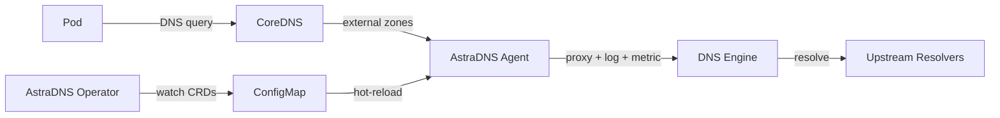

---
hide:
  - navigation
---

# AstraDNS

**Visibilidad, seguridad y control de costos sobre el DNS externo en Kubernetes.**

---

Los clústeres de Kubernetes realizan miles de consultas DNS externas cada minuto, hacia registros de paquetes, APIs SaaS, bases de datos y servicios de terceros. Hoy en día, estas consultas salen del clúster con **cero visibilidad**, **sin controles de seguridad** y **sin caché**.

AstraDNS despliega un plano de resolución DNS administrado en cada nodo, brindando a los equipos de plataforma control total sobre la resolución DNS externa.

<div class="grid cards" markdown>

-   :material-chart-line:{ .lg .middle } **Observabilidad**

    ---

    Métricas por nodo, registros de consultas estructurados y dashboards de Grafana. Sepa exactamente qué están resolviendo sus cargas de trabajo, qué tan rápido y dónde ocurren las fallas.

-   :material-shield-check:{ .lg .middle } **Seguridad**

    ---

    Políticas DNS con alcance por namespace, listas de dominios permitidos/denegados y detección de anomalías. Controle qué cargas de trabajo pueden resolver qué dominios.

-   :material-currency-usd:{ .lg .middle } **Optimización de Costos**

    ---

    Caché inteligente con TTLs configurables y prefetch. Reduzca el tráfico DNS de salida entre un 40-70% con ratios de aciertos de caché medibles.

-   :material-kubernetes:{ .lg .middle } **Nativo de Kubernetes**

    ---

    Completamente declarativo mediante CRDs. Instale con un solo `helm install`, configure con YAML. Sin sidecars, sin reglas de iptables, sin cambios en el código.

</div>

## Cómo Funciona



1. **Operator** observa los CRDs (`DNSUpstreamPool`, `DNSCacheProfile`, `ExternalDNSPolicy`) y genera la configuración del motor en un ConfigMap.
2. **Agent** se ejecuta como un DaemonSet en cada nodo, enrutando las consultas DNS a través de un motor DNS intercambiable (Unbound, CoreDNS o PowerDNS).
3. Cada consulta se registra, se mide y se verifica su salud, sin modificar el código de su aplicación.

## Inicio Rápido

```bash
helm install astradns deploy/helm/astradns \
  --namespace astradns-system --create-namespace \
  --set agent.network.mode=linkLocal \
  --set coredns.integration.enabled=true
```

Luego cree su primer pool de upstreams:

```yaml
apiVersion: dns.astradns.com/v1alpha1
kind: DNSUpstreamPool
metadata:
  name: production
  namespace: astradns-system
spec:
  upstreams:
    - address: "1.1.1.1"
    - address: "8.8.8.8"
  healthCheck:
    enabled: true
    intervalSeconds: 30
  loadBalancing:
    strategy: round-robin
```

[:octicons-arrow-right-24: Primeros Pasos](getting-started/index.md){ .md-button .md-button--primary }
[:octicons-book-24: Arquitectura](architecture/index.md){ .md-button }
