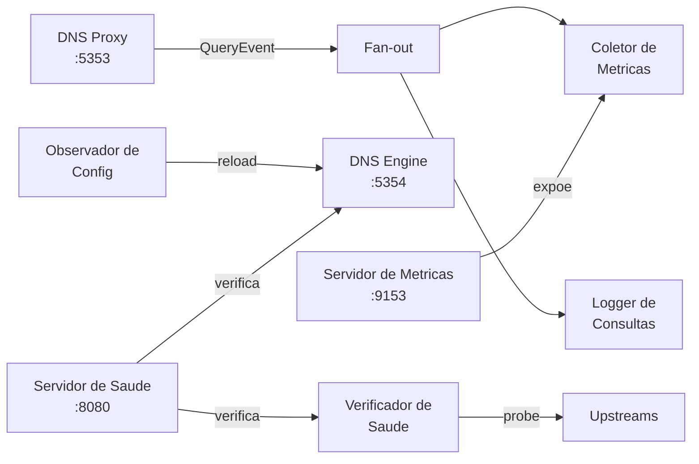

# Componentes

O AstraDNS consiste em quatro componentes principais distribuidos em dois planos.

## Operator

| Propriedade | Valor |
|-------------|-------|
| Kind | Deployment |
| Replicas | 1 (com eleicao de lider para HA) |
| Imagem | `astradns/operator` |
| Portas | 8081 (saude), 8443 (metricas), 9443 (webhook) |

O operator executa tres controllers:

### Controller DNSUpstreamPool

Observa recursos `DNSUpstreamPool` e renderiza a configuracao do engine.

**Fluxo de reconciliacao:**

1. Valida a spec do pool (enderecos, portas)
2. Adiciona a anotacao `dns.astradns.com/initial-resource-version` na primeira reconciliacao
3. Seleciona o pool ativo (mais antigo por timestamp de criacao, depois RV inicial, depois nome)
4. Busca o `default` DNSCacheProfile (se existir)
5. Gera o `EngineConfig` agnostico de engine
6. Valida renderizando atraves do renderer do engine ativo
7. Serializa como JSON e escreve no ConfigMap
8. Define a condicao `Ready=True` no pool ativo
9. Define `Ready=False, Reason=Superseded` em quaisquer pools nao ativos

### Controller DNSCacheProfile

Valida a configuracao de cache e define a condicao `Active`. O perfil com o nome `default` e automaticamente utilizado pelo controller do upstream pool.

### Controller ExternalDNSPolicy

Valida referencias cruzadas com pools de upstreams e perfis de cache. Define condicoes `Validated=True/False`.

## Agent

| Propriedade | Valor |
|-------------|-------|
| Kind | DaemonSet |
| Imagem | `astradns/agent` |
| Portas | 5353 (DNS), 8080 (saude), 9153 (metricas) |

O agent executa sete componentes em goroutines paralelas:



| Componente | Responsabilidade |
|------------|------------------|
| **DNS Proxy** | Intercepta consultas em :5353 (UDP+TCP), encaminha para o engine em :5354, emite QueryEvent |
| **Coletor de Metricas** | Consome QueryEvents, atualiza contadores/histogramas Prometheus |
| **Logger de Consultas** | Consome QueryEvents, escreve JSON estruturado no stdout |
| **Verificador de Saude** | Sonda resolvers upstream periodicamente (UDP com fallback TCP) |
| **Observador de Config** | Observa o diretorio do ConfigMap via fsnotify, aciona reload do engine |
| **Servidor de Saude** | Servidor HTTP expondo `/healthz` (engine ativo) e `/readyz` (engine + upstreams) |
| **Servidor de Metricas** | Servidor HTTP expondo `/metrics` no formato Prometheus |

## CRDs

Tres Custom Resource Definitions no grupo de API `dns.astradns.com`:

| CRD | Finalidade | Escopo |
|-----|-----------|--------|
| `DNSUpstreamPool` | Definir resolvers upstream, health checks, balanceamento de carga | Namespaced |
| `DNSCacheProfile` | Configurar tamanho do cache, limites de TTL, prefetch | Namespaced |
| `ExternalDNSPolicy` | Mapear namespaces para pools e perfis de cache | Namespaced |

Consulte a [Referencia de CRDs](../reference/crds/index.md) para a documentacao completa dos campos.

## DNS Engine

O engine e um subprocesso gerenciado pelo agent. Tres engines sao suportados:

| Engine | Arquivo de Configuracao | Metodo de Reload | Padrao |
|--------|------------------------|------------------|--------|
| **Unbound** | `unbound.conf` | `unbound-control reload` | Sim |
| **CoreDNS** | `Corefile` | Plugin de auto-reload | Nao |
| **PowerDNS Recursor** | `recursor.conf` | `rec_control reload-zones` | Nao |

Todos os engines implementam a mesma interface Go:

```go
type Engine interface {
    Configure(ctx context.Context, config EngineConfig) (string, error)
    Start(ctx context.Context) error
    Reload(ctx context.Context) error
    Stop(ctx context.Context) error
    HealthCheck(ctx context.Context) (bool, error)
    Name() EngineType
}
```

Consulte [Selecao de Engine](engine-selection.md) para orientacoes sobre como escolher um engine.
