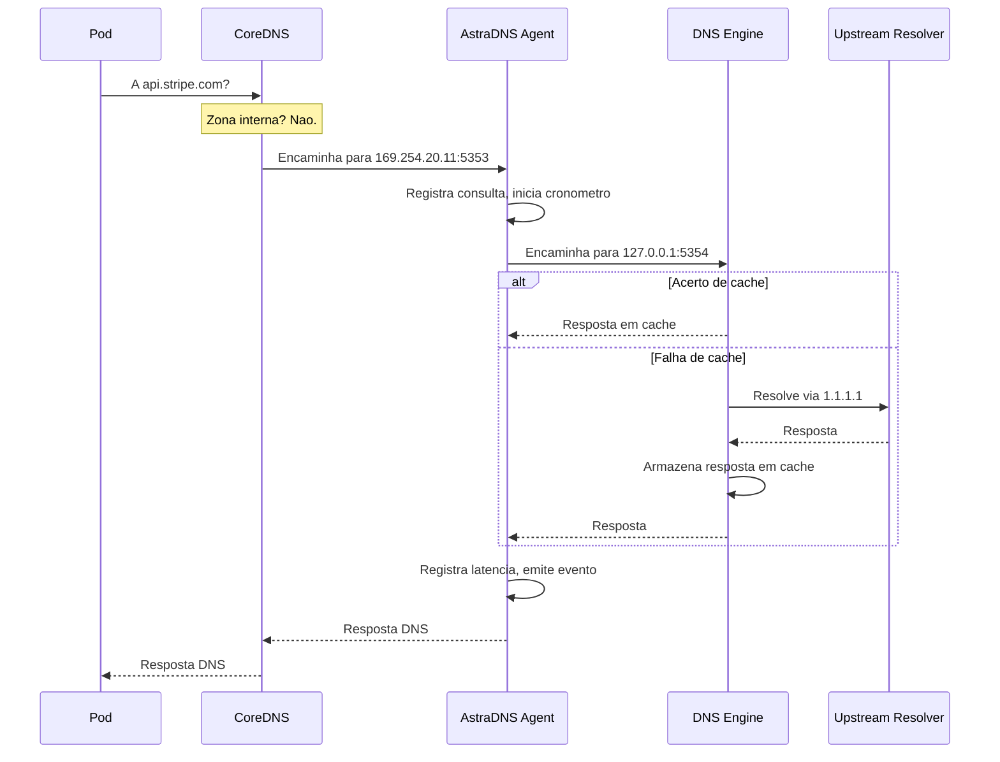

# Caminho de Dados

Entender como as consultas DNS fluem pelo AstraDNS e fundamental para depuracao, planejamento de capacidade e analise de seguranca.

## Fluxo de Consulta



## Modos de Rede

### hostPort (padrao)

O agent se conecta a porta `5353` no IP primario do no via `hostPort` do Kubernetes.

```
Pod -> CoreDNS -> No:5353 (agent) -> 127.0.0.1:5354 (engine) -> upstream
```

- Simples de configurar
- Nao requer host network
- O CoreDNS deve ser configurado para encaminhar para `<nodeIP>:5353`

### linkLocal (recomendado)

Por padrao, o agent se conecta ao endereco link-local `169.254.20.11:5353` usando `hostNetwork: true`.

```
Pod -> CoreDNS -> <linkLocalIP>:5353 (agent) -> 127.0.0.1:5354 (engine) -> upstream
```

- Endereco e porta estaveis em todos os nos
- Endereco configurado consistente em todos os nos
- CoreDNS encaminha para um unico endereco independente do IP do no
- Segue o padrao estabelecido do NodeLocal DNS Cache

!!! tip "Recomendacao para producao"
    Use o modo linkLocal com a integracao CoreDNS habilitada. Esta e a configuracao mais confiavel e amplamente testada.

## Comportamento do Cache

Cada no mantem seu proprio cache. Nao ha compartilhamento de cache entre nos.

| Propriedade | Controlado Por |
|-------------|----------------|
| Maximo de entradas | `DNSCacheProfile.spec.maxEntries` |
| TTL positivo minimo | `DNSCacheProfile.spec.positiveTtl.minSeconds` |
| TTL positivo maximo | `DNSCacheProfile.spec.positiveTtl.maxSeconds` |
| TTL negativo | `DNSCacheProfile.spec.negativeTtl.seconds` |
| Prefetch | `DNSCacheProfile.spec.prefetch.enabled` |
| Limite de prefetch | `DNSCacheProfile.spec.prefetch.threshold` |

!!! info "Isolamento de cache por no"
    O cache e isolado por no. Uma consulta armazenada em cache no No A nao esta disponivel no No B. Esta e uma decisao de design deliberada para isolamento de falhas -- um cache envenenado em um no nao se propaga para os outros.

## Modos de Falha

| Falha | Comportamento | Recuperacao |
|-------|---------------|-------------|
| Pod do agent falha | CoreDNS tenta o upstream de fallback | Reinicio do agent via DaemonSet/Deployment |
| Subprocesso do engine morre | `/healthz` retorna 503, pod reinicia | Automatico via liveness probe |
| Upstream inacessivel | Verificador de saude marca como nao saudavel, SERVFAIL retornado | Automatico quando o upstream se recupera |
| ConfigMap invalido | Reload falha, configuracao anterior mantida | Corrija o CRD, operator re-renderiza |
| Operator fora do ar | Nenhuma alteracao de config processada, config existente continua | Operator reinicia via Deployment |

## Suporte a Protocolos

| Recurso | Status |
|---------|--------|
| Consultas UDP | Suportado |
| Consultas TCP | Suportado |
| EDNS | Passthrough |
| DNSSEC | Passthrough (engine valida se configurado) |
| DNS-over-TLS | Nao suportado (planejado) |
| DNS-over-HTTPS | Nao suportado (planejado) |
