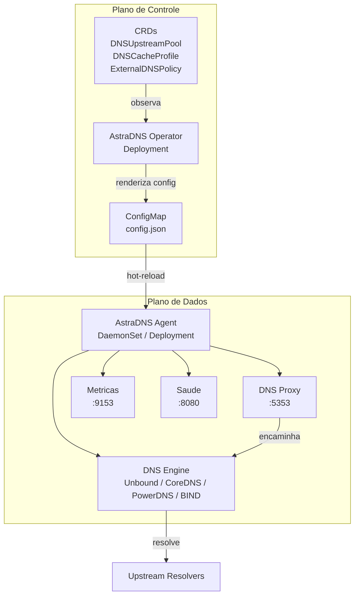

# Visao Geral da Arquitetura

O AstraDNS implanta um **plano de resolucao DNS** junto ao seu cluster Kubernetes, dando as equipes de plataforma controle total sobre como as cargas de trabalho resolvem dominios externos.

## O Problema

Hoje, quando um pod resolve `api.stripe.com`, a consulta passa pelo CoreDNS ate o resolver upstream configurado pelo provedor de nuvem. As equipes de plataforma tem:

- **Nenhuma visibilidade** sobre o que esta sendo resolvido, com que frequencia ou quao lento
- **Nenhum controle de seguranca** sobre quais cargas de trabalho podem resolver quais dominios
- **Nenhum controle de cache** para reduzir latencia DNS e custos de saida

## A Solucao

O AstraDNS introduz dois componentes:

### Plano de Controle: Operator

Um Deployment de replica unica que:

1. Observa tres CRDs para alteracoes de configuracao
2. Monta um `EngineConfig` agnostico de engine a partir das specs dos CRDs
3. Renderiza configuracao especifica do engine (Unbound conf, Corefile, recursor.conf ou named.conf)
4. Escreve a configuracao renderizada em um ConfigMap
5. Define condicoes de status nos CRDs (Ready, Superseded, InvalidSpec)

### Plano de Dados: Agent

Uma carga executando como DaemonSet (`node-local`) ou Deployment (`central`) que:

1. Inicia um engine DNS plugavel como subprocesso (padrao: Unbound)
2. Executa um proxy DNS na porta 5353 que intercepta todas as consultas
3. Encaminha consultas para o engine na porta 5354
4. Emite eventos por consulta para um coletor de metricas e logger de consultas
5. Observa o ConfigMap para alteracoes e faz hot-reload do engine
6. Verifica a saude dos resolvers upstream e expoe o status via `/healthz` e `/readyz`

## Principios de Design

**Nativo do Kubernetes**
:   Toda configuracao e declarativa via CRDs. Sem APIs imperativas, sem ferramentas CLI, sem bancos de dados externos.

**Seguro por padrao**
:   Uma falha do AstraDNS nao deve quebrar o DNS. O CoreDNS mantem seu upstream original como fallback. O proxy do agent retorna SERVFAIL em caso de falha do engine, o que aciona nova tentativa no nivel do CoreDNS.

**Observavel desde o dia 1**
:   Cada consulta e medida. Metricas Prometheus, logs estruturados e dashboards Grafana sao recursos de primeira classe, nao adicionados depois.

**Raio de impacto minimo**
:   Cada no tem seu proprio agent e cache. Uma falha em um no nao afeta os outros.

**Engine plugavel**
:   O engine DNS e um detalhe de implementacao por tras de uma interface Go. Troque o Unbound pelo CoreDNS sem alterar CRDs ou a camada de proxy do agent.
