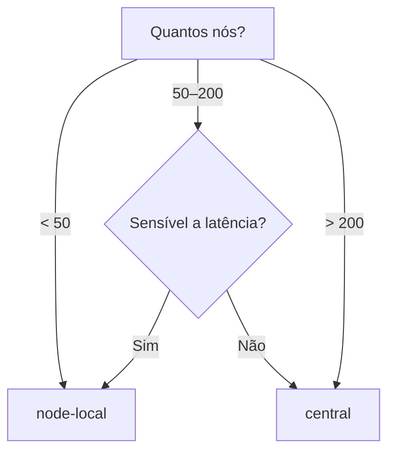

# Perfis de Topologia

O AstraDNS suporta duas topologias de deploy para o Agent, permitindo equilibrar latência contra custo de recursos.

## Escolhendo um Perfil



| Fator | node-local | central |
|-------|-----------|---------|
| Tamanho do cluster | Qualquer (ideal < 100) | 50+ nós |
| Latência DNS | < 1 ms | ~1–2 ms |
| Overhead de memória | 128 Mi × N nós | 128 Mi × réplicas |
| Isolamento de cache | Por nó | Por réplica (compartilhado) |
| Raio de falha | Nó individual | Conjunto de réplicas |

## node-local (Padrão)

O perfil padrão implanta o Agent como um DaemonSet em cada nó elegível. Cada pod se liga ao endereço link-local `169.254.20.11` e o CoreDNS em cada nó encaminha para ele.

```
Pod → CoreDNS → 169.254.20.11:53 (Agent DaemonSet) → Engine → Upstream
```

Esta é a mesma arquitetura do [ADR-001](../decisions/adr-001.md). Nenhuma configuração adicional é necessária.

```yaml
agent:
  topology:
    profile: node-local  # este é o padrão
```

### Quando usar

- Clusters pequenos a médios (< 100 nós)
- Workloads sensíveis a latência (financeiro, tempo real)
- Ambientes onde isolamento de cache por nó é requisito

## central

O perfil `central` implanta o Agent como um Deployment com contagem fixa de réplicas, atrás de um Service ClusterIP. O CoreDNS encaminha para o FQDN do Service em vez de um IP link-local.

```
Pod → CoreDNS → astradns-agent-dns.astradns-system.svc.cluster.local:53 (Service) → Agent Deployment → Engine → Upstream
```

```yaml
agent:
  topology:
    profile: central

  deployment:
    replicas: 3
    strategy:
      type: RollingUpdate
    topologySpreadConstraints:
      - maxSkew: 1
        topologyKey: kubernetes.io/hostname
        whenUnsatisfiable: DoNotSchedule

  dnsService:
    type: ClusterIP
    port: 53
    sessionAffinity: ClientIP
    sessionAffinityTimeoutSeconds: 1800
```

### Quando usar

- Clusters grandes (100+ nós) onde pods DNS por nó são desperdício
- Ambientes otimizados para custo dispostos a aceitar ~1–2 ms de latência
- Plataformas multi-tenant onde gestão centralizada de DNS é preferida

### Guia de dimensionamento

| Nós do cluster | Réplicas recomendadas | Memória estimada |
|---------------|----------------------|-----------------|
| 50–100 | 2 | 256 Mi |
| 100–300 | 3 | 384 Mi |
| 300–1000 | 5 | 640 Mi |
| 1000+ | 7–10 | 896 Mi – 1.28 Gi |

Estes são pontos de partida. Monitore `astradns_queries_total` por réplica e escale com base na taxa real de queries.

### Afinidade de sessão

`sessionAffinity: ClientIP` garante que queries do mesmo IP de origem sempre cheguem à mesma réplica do Agent. Isso mantém o cache de cada réplica aquecido para seus clientes, melhorando a taxa de acerto sem sacrificar failover — se uma réplica cair, o kube-proxy roteia automaticamente para outra.

O timeout padrão (1800s / 30 min) equilibra aquecimento do cache com rebalanceamento após eventos de escalonamento.

## Guardrails

O chart Helm aplica compatibilidade:

| Condição | Comportamento |
|----------|---------------|
| `profile=central` + `network.mode=linkLocal` | `fail` — link-local requer DaemonSet em cada nó |
| `profile=central` com `replicas < 2` | Aviso em NOTES.txt (sem HA) |
| `profile=central` sem `topologySpreadConstraints` | Spread padrão por hostname aplicado |
| `profile=central` | PDB criado com `minAvailable: 1` |

## Integração CoreDNS

No modo `node-local`, o job de patch do CoreDNS configura encaminhamento para `169.254.20.11`.

No modo `central`, ele configura encaminhamento para o FQDN do Service:

```
forward . astradns-agent-dns.astradns-system.svc.cluster.local:53
```

!!! note "Sem dependência circular"
    O CoreDNS resolve nomes `.svc.cluster.local` via seu plugin `kubernetes` embutido, que observa a API do Kubernetes diretamente. Ele **não** usa encaminhamento DNS para resolver nomes de Service, portanto não há dependência circular.

## Migrando de node-local para central

1. **Implante central ao lado do node-local** — instale um segundo release com `profile=central` em um namespace diferente para validar o comportamento.

2. **Verifique a resolução DNS** através do Service central:
    ```bash
    kubectl run dns-test --rm -it --restart=Never --image=busybox:1.37 -- \
      nslookup example.com astradns-agent-dns.astradns-system.svc.cluster.local
    ```

3. **Mude o perfil** no seu release primário:
    ```yaml
    agent:
      topology:
        profile: central
      deployment:
        replicas: 3
    ```

4. **Aplique e monitore**:
    ```bash
    helm upgrade astradns astradns/astradns -f values.yaml -n astradns-system
    ```

5. **Observe as métricas** durante a primeira hora:
    - `astradns_queries_total` — verifique se o tráfego está fluindo
    - `astradns_upstream_latency_seconds` — compare p95 com o baseline
    - `astradns_cache_hits_total` — confirme que o cache está aquecendo

## Relacionados

- [ADR-009: Perfis de Topologia do Agent](../decisions/adr-009.md) — o registro de decisão
- [ADR-001: Interceptação do Caminho de Dados](../decisions/adr-001.md) — o padrão NodeLocal DNS original
- [Deploy em Produção](production-deployment.md) — checklist geral de produção
