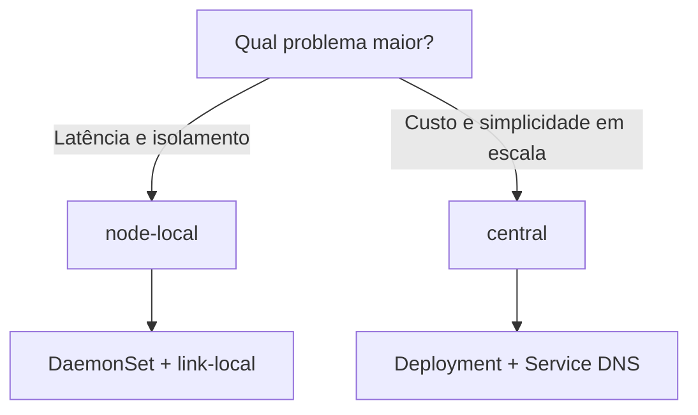

# Perfis de Topologia do Agent

O AstraDNS oferece dois perfis de topologia para o Agent:

- `node-local` (padrão): DaemonSet em todos os nós elegíveis, com encaminhamento local.
- `central`: Deployment com réplicas fixas atrás de um Service DNS.

O objetivo desta página é ajudar você a escolher o perfil certo para o seu cluster e entender os impactos reais em latência, custo, cache e operação.

---

## Resumo executivo

Se você quer decisão rápida:

- **Escolha `node-local`** quando latência mínima e isolamento por nó são prioridade.
- **Escolha `central`** quando seu cluster é grande e custo operacional por nó está alto.



---

## Por que apenas dois perfis

Historicamente, uma opção intermediária (`dns-pool`) parece atraente, mas na prática ela repete o modo central com diferença mínima:

- para beneficiar pods em todos os nós, o tráfego passa por Service de qualquer forma;
- afinidade para pool dedicado pode ser feita no próprio Deployment (`nodeAffinity`);
- manter um terceiro perfil aumenta complexidade de chart sem ganho proporcional.

Por isso, a recomendação é manter somente:

1. `node-local`
2. `central`

---

## Matriz de decisão

| Fator | `node-local` | `central` |
|---|---|---|
| Workload Kubernetes | DaemonSet | Deployment |
| Roteamento DNS | link-local/hostPort por nó | Service ClusterIP |
| Latência típica | sub-milissegundo até ~1 ms | ~1-2 ms intra-cluster |
| Uso de memória | proporcional ao número de nós | proporcional às réplicas |
| Cache | por nó (isolado) | por réplica (compartilhado) |
| Blast radius | falha isolada por nó | por réplica/grupo |
| Escala | adiciona nós | ajusta `replicas` |

!!! tip "Regra de bolso"
    Clusters pequenos/médios e sensíveis a latência tendem a ganhar com `node-local`.
    Clusters grandes e orientados a custo tendem a ganhar com `central`.

---

## Perfil `node-local` (padrão)

No modo `node-local`, cada nó elegível roda seu próprio Agent.

```text
Pod -> CoreDNS -> 169.254.20.11:53 (Agent local) -> Engine -> Upstream
```

### Configuração mínima

```yaml
agent:
  topology:
    profile: node-local
  network:
    mode: linkLocal
    linkLocalIP: 169.254.20.11

clusterDNS:
  forwardExternalToAstraDNS:
    enabled: true
    forwardTarget: 169.254.20.11:5353
```

### Quando escolher

- workloads de baixa latência;
- necessidade de isolamento de cache por nó;
- ambientes onde falha de um nó não deve afetar o restante.

---

## Perfil `central`

No modo `central`, o Agent roda como Deployment e é exposto por Service DNS (UDP/TCP 53).

```text
Pod -> CoreDNS -> Service DNS do AstraDNS -> Agent Deployment -> Engine -> Upstream
```

### Configuração mínima recomendada

```yaml
agent:
  topology:
    profile: central

  deployment:
    replicas: 3
    strategy:
      type: RollingUpdate
    topologySpreadConstraints:
      - maxSkew: 1
        topologyKey: kubernetes.io/hostname
        whenUnsatisfiable: DoNotSchedule

  dnsService:
    type: ClusterIP
    port: 53
    sessionAffinity: ClientIP
    sessionAffinityTimeoutSeconds: 1800
```

### Endereço alvo do CoreDNS em `central`

O chart usa esta estratégia:

1. Se `agent.dnsService.clusterIP` estiver definido, usa IP fixo (preferível para estabilidade).
2. Se estiver vazio, descobre o `clusterIP` do Service em tempo de execução no patch job.

Isso evita depender de FQDN no Corefile quando você quer destino estável por IP.

### Quando escolher

- clusters grandes (alto custo de DaemonSet por nó);
- operação centralizada de DNS;
- preferência por escalar por réplicas e não por número de nós.

---

## Cache e afinidade de sessão

No modo `central`, o `sessionAffinity: ClientIP` ajuda a manter cache aquecido por cliente.

- Com `ClientIP`, o mesmo cliente tende a bater na mesma réplica.
- Com `None`, o tráfego distribui mais, mas cada réplica perde calor de cache.

Recomendação padrão: `ClientIP` com timeout de 30 min (`1800s`).

---

## Guardrails do chart

O Helm já bloqueia combinações perigosas:

| Condição | Resultado |
|---|---|
| `profile=central` + `network.mode=linkLocal` | `fail` no template |
| `profile=node-local` + CoreDNS patch + `network.mode!=linkLocal` | `fail` no template |
| `profile=central` + PDB | usa `minAvailable: 1` |
| `profile=central` + spread vazio | default por hostname aplicado |

!!! warning "HA em central"
    Rodar `replicas: 1` em `central` remove alta disponibilidade.
    Para produção, mantenha `replicas >= 2`.

---

## Migração sem downtime

### node-local -> central

1. Suba `central` em paralelo (release separado ou janela controlada).
2. Verifique Service DNS do Agent (`kubectl get svc ...`).
3. Aplique patch do CoreDNS para apontar ao target central.
4. Monitore métricas por 30-60 minutos.
5. Desative o modo node-local.

### central -> node-local

1. Suba DaemonSet node-local.
2. Garanta cobertura nos nós de workload.
3. Reaponte CoreDNS para o target link-local.
4. Monitore latência e erros.
5. Remova Deployment central.

---

## Checklist de validação pós-mudança

```bash
# 1) CoreDNS aponta para o target esperado
kubectl -n kube-system get configmap coredns -o jsonpath='{.data.Corefile}'

# 2) Pods do agent saudáveis
kubectl -n astradns-system get pods -l app.kubernetes.io/component=agent

# 3) Service DNS (somente central)
kubectl -n astradns-system get svc <release>-astradns-agent-dns

# 4) Smoke test de resolução
kubectl run dns-test --rm -it --restart=Never --image=busybox:1.37 -- nslookup example.com
```

Métricas que devem ser observadas na primeira hora:

- `astradns_queries_total`
- `astradns_upstream_latency_seconds`
- `astradns_upstream_failures_total`
- `astradns_cache_hits_total`
- `astradns_servfail_total`

---

## Referências

- [ADR-009: Perfis de Topologia do Agent](../decisions/adr-009.md)
- [ADR-001: Interceptação do Caminho de Dados](../decisions/adr-001.md)
- [Deploy em Produção](production-deployment.md)
