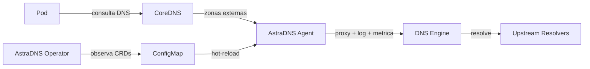

---
hide:
  - navigation
---

# AstraDNS

**Visibilidade, segurança e controle de custos sobre DNS externo no Kubernetes.**

---

Clusters Kubernetes fazem milhares de consultas DNS externas a cada minuto -- para registros de pacotes, APIs SaaS, bancos de dados e serviços de terceiros. Hoje, essas consultas saem do cluster com **zero visibilidade**, **nenhum controle de segurança** e **nenhum cache**.

O AstraDNS implanta um plano de resolução DNS gerenciado em cada nó, dando às equipes de plataforma controle total sobre a resolução DNS externa.

<div class="grid cards" markdown>

-   :material-chart-line:{ .lg .middle } **Observabilidade**

    ---

    Métricas por nó, logs de consulta estruturados e dashboards Grafana. Saiba exatamente o que suas cargas de trabalho estão resolvendo, com que velocidade e onde ocorrem as falhas.

-   :material-shield-check:{ .lg .middle } **Segurança**

    ---

    Políticas DNS com escopo por namespace, listas de domínios permitidos/bloqueados e detecção de anomalias. Controle quais cargas de trabalho podem resolver quais domínios.

-   :material-currency-usd:{ .lg .middle } **Otimização de Custos**

    ---

    Cache inteligente com TTLs configuráveis e prefetch. Reduza o tráfego DNS de saída em 40-70% com taxas de acerto de cache mensuráveis.

-   :material-kubernetes:{ .lg .middle } **Nativo do Kubernetes**

    ---

    Totalmente declarativo via CRDs. Instale com um único `helm install`, configure com YAML. Sem sidecars, sem regras iptables, sem alterações no código.

</div>

## Como Funciona



1. O **Operator** observa CRDs (`DNSUpstreamPool`, `DNSCacheProfile`, `ExternalDNSPolicy`) e renderiza a configuração do engine em um ConfigMap.
2. O **Agent** roda em topologia `node-local` (DaemonSet) ou `central` (Deployment + Service), encaminhando consultas DNS por um engine plugável (`unbound`, `coredns`, `powerdns` ou `bind`).
3. Cada consulta é registrada, medida e verificada -- sem tocar no código da sua aplicação.

## Início Rápido

```bash
helm upgrade --install astradns deploy/helm/astradns \
  --namespace astradns-system --create-namespace \
  --set agent.engineType=unbound \
  --set agent.network.mode=linkLocal \
  --set clusterDNS.forwardExternalToAstraDNS.enabled=true
```

Em seguida, crie seu primeiro pool de upstreams:

```yaml
apiVersion: dns.astradns.com/v1alpha1
kind: DNSUpstreamPool
metadata:
  name: production
  namespace: astradns-system
spec:
  upstreams:
    - address: "1.1.1.1"
    - address: "8.8.8.8"
  healthCheck:
    enabled: true
    intervalSeconds: 30
  loadBalancing:
    strategy: round-robin
```

## O Que Escolher Em Seguida

- **Perfil de topologia**: use `node-local` para menor latencia, ou `central` para replicas compartilhadas e menor custo por nó.
- **Engine**: configure apenas `agent.engineType`; o chart fixa automaticamente as imagens oficiais por engine.
- **Como rodar e testar**: siga o fluxo em Contribuindo para stack local e checks equivalentes ao CI.

[:octicons-arrow-right-24: Primeiros Passos](getting-started/index.md){ .md-button .md-button--primary }
[:octicons-book-24: Arquitetura](architecture/index.md){ .md-button }
