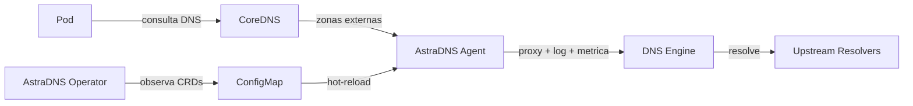

---
hide:
  - navigation
---

# AstraDNS

**Visibilidade, seguranca e controle de custos sobre DNS externo no Kubernetes.**

---

Clusters Kubernetes fazem milhares de consultas DNS externas a cada minuto -- para registros de pacotes, APIs SaaS, bancos de dados e servicos de terceiros. Hoje, essas consultas saem do cluster com **zero visibilidade**, **nenhum controle de seguranca** e **nenhum cache**.

O AstraDNS implanta um plano de resolucao DNS gerenciado em cada no, dando as equipes de plataforma controle total sobre a resolucao DNS externa.

<div class="grid cards" markdown>

-   :material-chart-line:{ .lg .middle } **Observabilidade**

    ---

    Metricas por no, logs de consulta estruturados e dashboards Grafana. Saiba exatamente o que suas cargas de trabalho estao resolvendo, com que velocidade e onde ocorrem as falhas.

-   :material-shield-check:{ .lg .middle } **Seguranca**

    ---

    Politicas DNS com escopo por namespace, listas de dominios permitidos/bloqueados e deteccao de anomalias. Controle quais cargas de trabalho podem resolver quais dominios.

-   :material-currency-usd:{ .lg .middle } **Otimizacao de Custos**

    ---

    Cache inteligente com TTLs configuraveis e prefetch. Reduza o trafego DNS de saida em 40-70% com taxas de acerto de cache mensuraveis.

-   :material-kubernetes:{ .lg .middle } **Nativo do Kubernetes**

    ---

    Totalmente declarativo via CRDs. Instale com um unico `helm install`, configure com YAML. Sem sidecars, sem regras iptables, sem alteracoes no codigo.

</div>

## Como Funciona



1. O **Operator** observa CRDs (`DNSUpstreamPool`, `DNSCacheProfile`, `ExternalDNSPolicy`) e renderiza a configuracao do engine em um ConfigMap.
2. O **Agent** executa como um DaemonSet em cada no, encaminhando consultas DNS atraves de um engine DNS plugavel (Unbound, CoreDNS ou PowerDNS).
3. Cada consulta e registrada, medida e verificada -- sem tocar no codigo da sua aplicacao.

## Inicio Rapido

```bash
helm install astradns deploy/helm/astradns \
  --namespace astradns-system --create-namespace \
  --set agent.network.mode=linkLocal \
  --set coredns.integration.enabled=true
```

Em seguida, crie seu primeiro pool de upstreams:

```yaml
apiVersion: dns.astradns.com/v1alpha1
kind: DNSUpstreamPool
metadata:
  name: production
  namespace: astradns-system
spec:
  upstreams:
    - address: "1.1.1.1"
    - address: "8.8.8.8"
  healthCheck:
    enabled: true
    intervalSeconds: 30
  loadBalancing:
    strategy: round-robin
```

[:octicons-arrow-right-24: Primeiros Passos](getting-started/index.md){ .md-button .md-button--primary }
[:octicons-book-24: Arquitetura](architecture/index.md){ .md-button }
